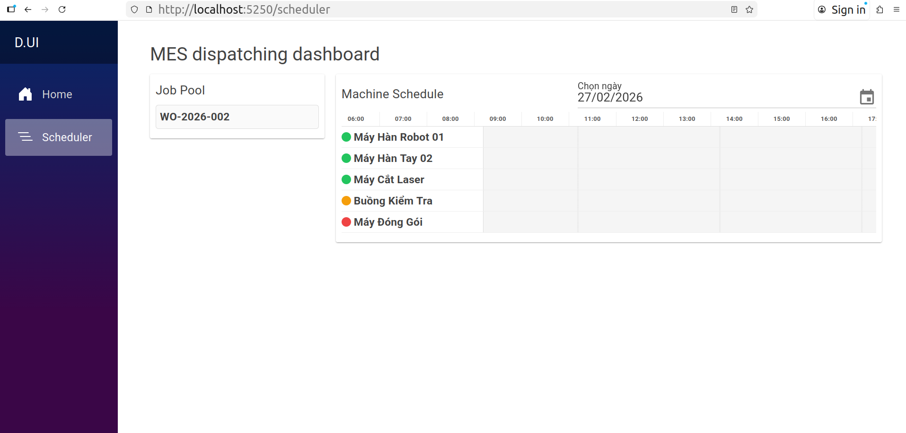
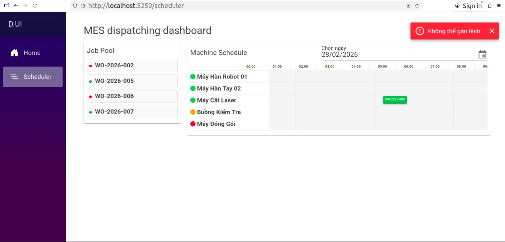
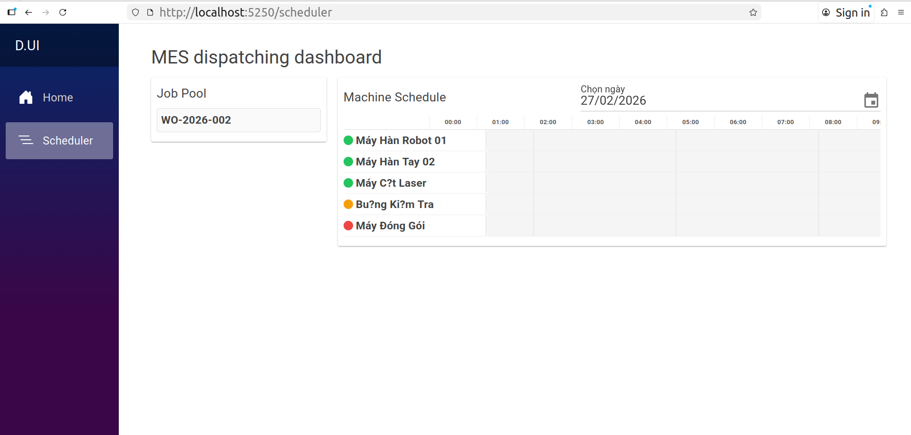

# D

<table border="0" cellpadding="0" cellspacing="0">
  <tr>
    <td></td>
    <td></td>
  </tr>
  <tr>
    <td colspan="2" align="center">
      
    </td>
  </tr>
</table>

## Tài liệu

- Tài liệu mô tả bài toán, nghiệp vụ cũng như danh sách API hoặc thiết đế giao diện được diễn giải tại các file trong thư mục `docs/` trong dự án.

## Tech stack

- C#, ASP.NET, Blazor
- Microsoft SQL Server
- Docker

## Cài đặt

- Clone dự án
- Chạy `./p-cm.sh`, chọn `1` để chạy dữ liệu ban đầu, `2` để chạy lệnh SQL trong file `check.sql` (bạn ghi lệnh SQL nào trong file này thì đều được RUN), `3` để xóa toàn bộ dữ liệu trong database nhưng vẫn giữ cấu trúc bảng.
- Chạy `./run.sh`
